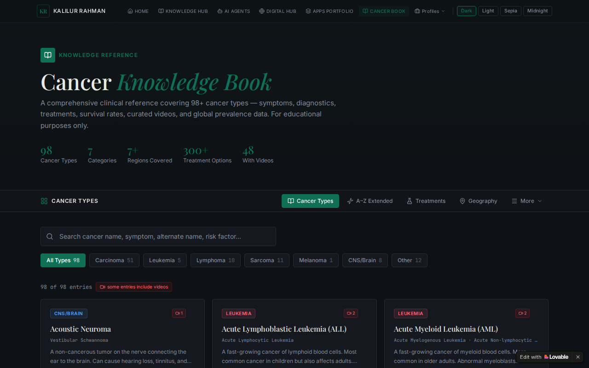
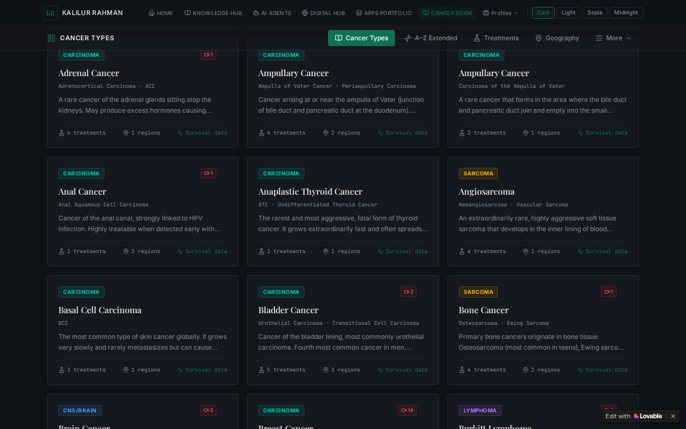
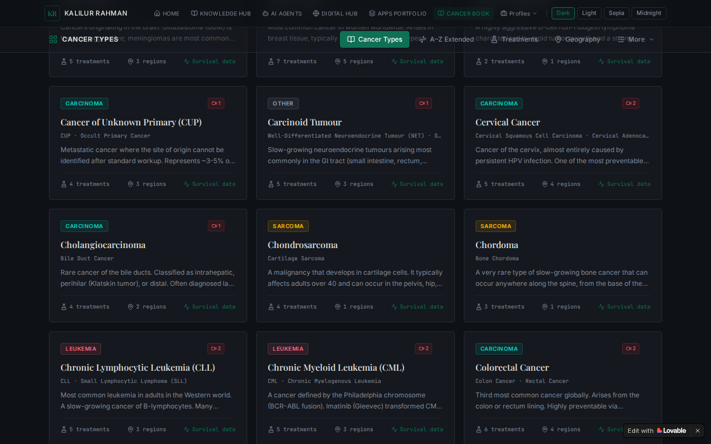

# Cancer Knowledge Explorer

Welcome to the Cancer Knowledge Explorer project! This is a React application built with TypeScript, Vite, and Tailwind CSS.

## Overview
Cancer Knowledge Explorer is designed to help users navigate and explore cancer-related information effectively.

## Demo
Here are some screenshots of the application:

You can also watch the generated video demo below:

[Demo Video](demo.mp4)

## Getting Started

1. Clone the repository.
2. Run `npm install` to install project dependencies.
3. Use `npm run dev` to start the local development server.

## Scripts
- `npm run dev` - Starts the development server.
- `npm run build` - Builds the project for production.
- `npm run lint` - Runs ESLint.

## Tech Stack
- React
- TypeScript
- Vite
- Tailwind CSS
- Radix UI
