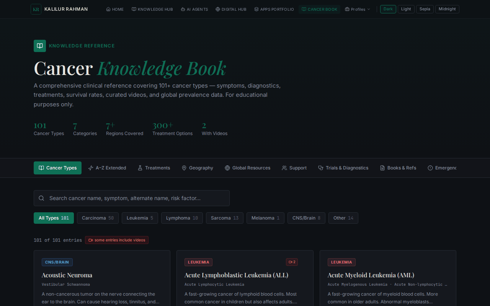
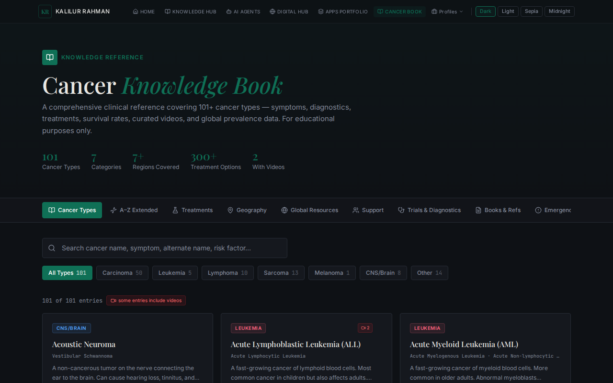
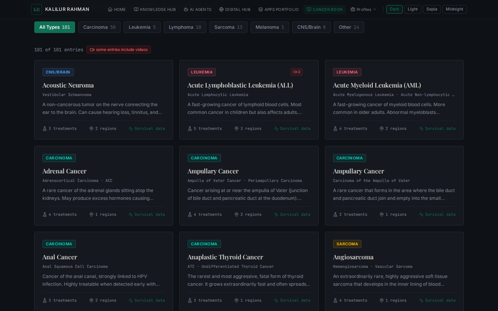
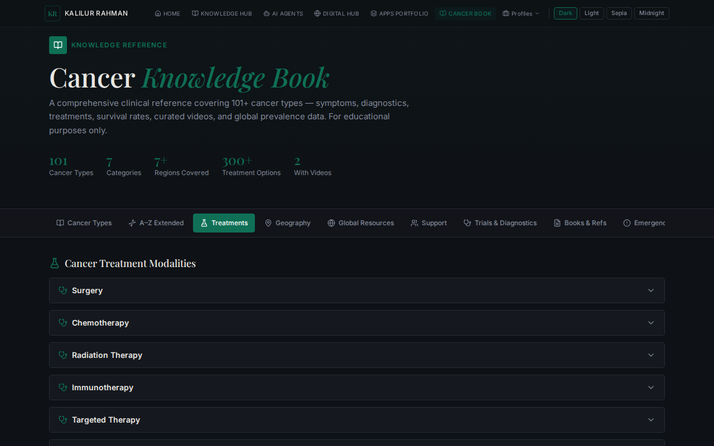
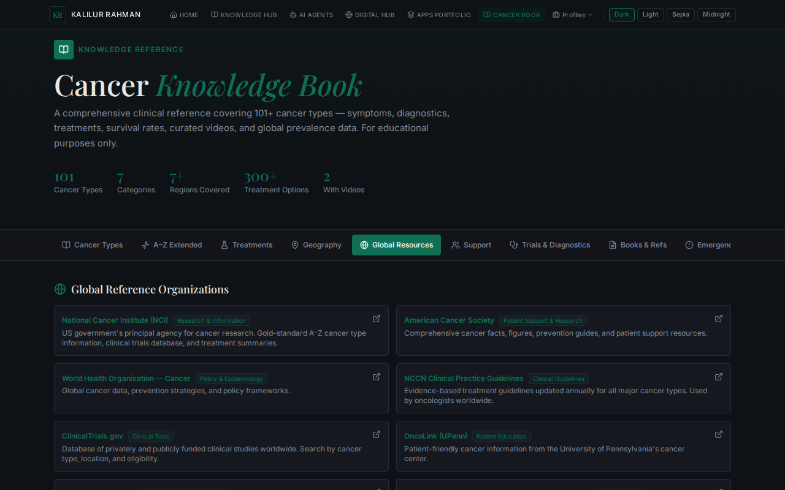

# Cancer Knowledge Explorer



A comprehensive clinical reference covering 101+ cancer types — symptoms, diagnostics, treatments, survival rates, curated videos, and global prevalence data. For educational purposes only.

## Features

- **Comprehensive Database**: Detailed information on 101+ cancer types.
- **Categorization**: Cancers are categorized by type (Carcinoma, Leukemia, Lymphoma, Sarcoma, Melanoma, CNS/Brain, etc.).
- **Treatments**: Information on various treatment options.
- **Global Resources**: Geographic prevalence data and global resources.
- **Trials & Diagnostics**: Information on clinical trials and diagnostic methods.

## Screenshots

### Home Page


### Cancer Types List


### Treatments View


### Global Resources View


## Getting Started

### Prerequisites

- Node.js (v18 or higher recommended)
- npm or yarn

### Installation

1. Clone the repository:
   ```bash
   git clone https://github.com/kalilurrahman/cancer-knowledge-explorer.git
   cd cancer-knowledge-explorer
   ```

2. Install dependencies:
   ```bash
   npm install
   ```

3. Start the development server:
   ```bash
   npm run dev &
   ```

4. Open your browser and navigate to `http://localhost:5173/`.

## Technology Stack

- React
- TypeScript
- Vite
- Tailwind CSS
- Radix UI
- Lucide Icons
- React Router DOM
- Framer Motion

## License

This project is open-source and available under the MIT License.
